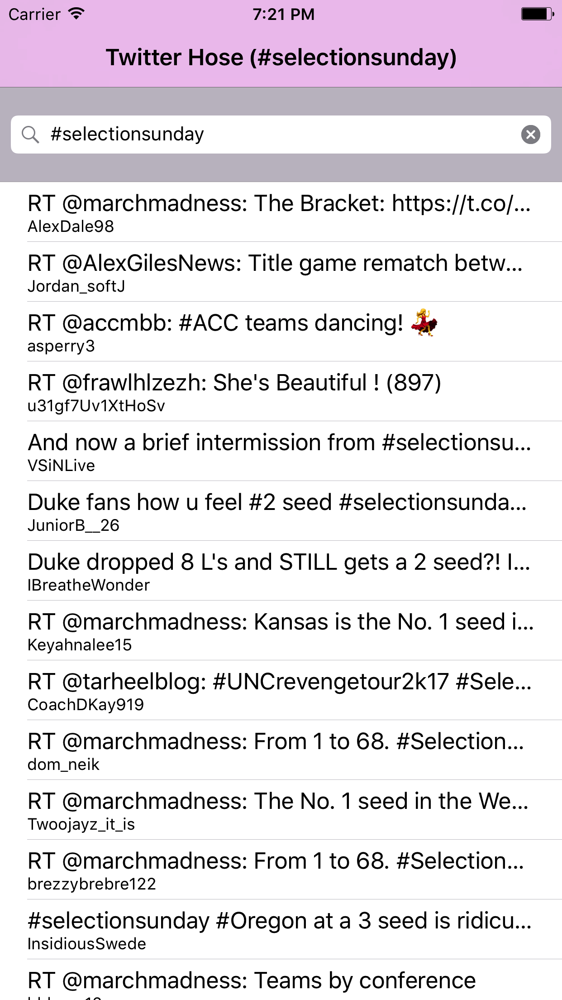

# TwitterStreamingClient

An iOS client that streams a twitter query

- [x] 📱 iOS 9.0+

## Architecture :triangular_ruler:

`TwitterStreamingClient` is fairly simple in that it attempts to make use of system frameworks to achieve a lot of the complexities of streaming twitter such as OAuth support, so despite being a very petite codebase a lot of logic is abstracted away in modern iOS frameworks. It contains 2 major classes:

1. A table view controller which is responsible for rendering cells in the table view and showing the search bar.

2. A model which is responsible for fetching the data from twitter and parsing it correctly.

## Usage
Simply open the Xcode project and run the target `TwitterStreamingClient`. Any code signing you want to do on a device will have to be setup manually. This was designed to be run on an iPhone 7+ simulator.

## Testing
Unfortunately no unit tests yet... but soon.
